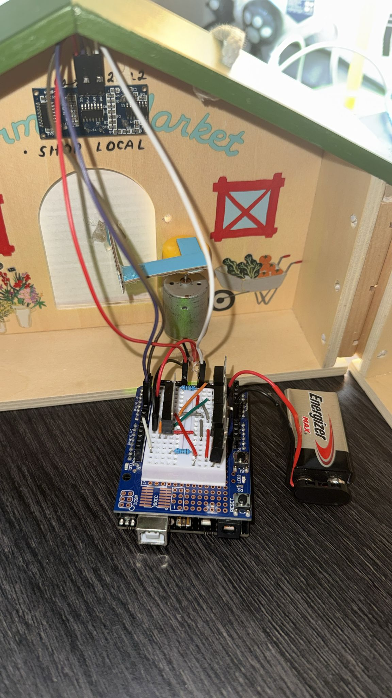
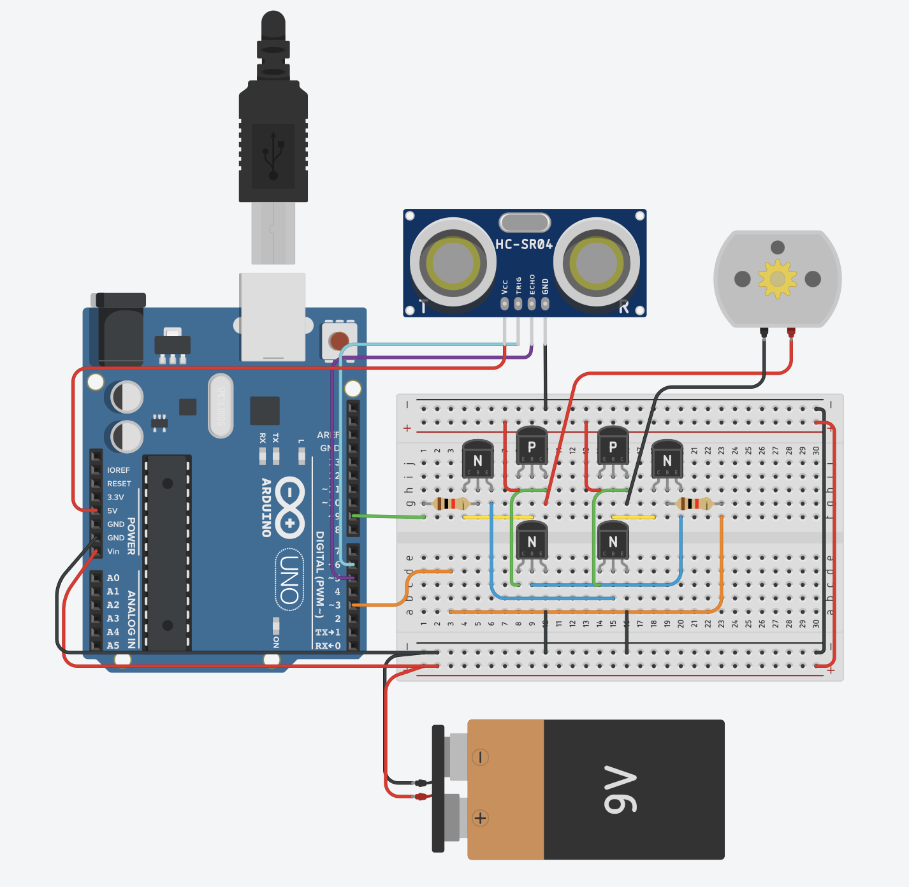
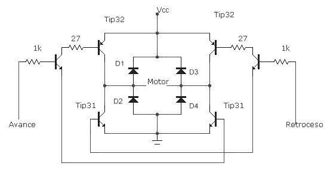
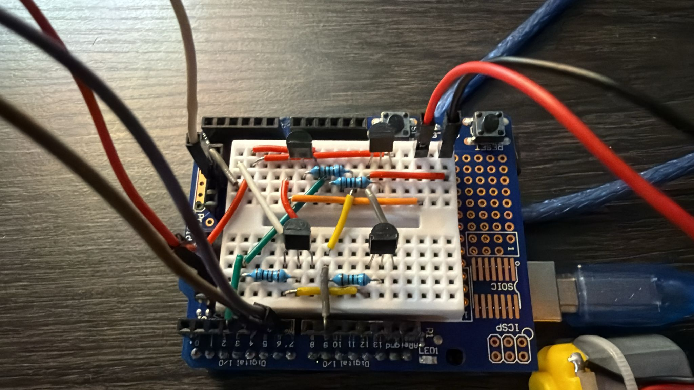
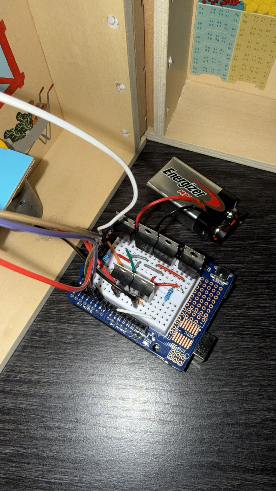

# Automatic Door System Using a Discrete H-Bridge

## Overview

This project presents the design and implementation of an automatic door system using an Arduino Uno, an HC-SR04 ultrasonic sensor, a 9 V DC motor, and a discrete H-bridge built with TIP31C (NPN) and TIP32C (PNP) transistors.

The system detects a nearby person or object using the ultrasonic sensor and automatically opens and closes a small model door. The project was developed as part of ELEN 330 and integrates analog electronics, digital control, sensing, motor control, and power electronics in a functional prototype.

## Prototype

<p align="center">
  
</p>

<p align="center">
  <em>Rev. A automatic door prototype integrating the Arduino-based controller, ultrasonic sensing, motor, and discrete H-bridge.</em>
</p>

## Project Type

- Academic design project
- Course: ELEN 330
- Institution: Universidad Ana G. Méndez
- Semester: Aug–Dec 2025

## Team

- Luis J. Negrón-Meléndez
- Noelia P. Vallejo-López
- Miguel A. De-Jesús-Rosa


## Problem Statement

Automatic access-control systems often rely on integrated motor drivers and proprietary controllers. This project explores a low-cost educational alternative that exposes the interaction between sensing, control logic, and discrete power-electronics hardware.

The system was designed to detect an object within a predefined distance and control a small door using an Arduino Uno, HC-SR04 ultrasonic sensor, and a discrete transistor H-bridge.

## Objectives

### General Objective

Design, build, and experimentally validate an automatic door system capable of bidirectional motor control using an Arduino-based controller, ultrasonic sensing, and a discrete H-bridge.

### Specific Objectives

- Build an H-bridge using TIP31C and TIP32C transistors.
- Drive a 9 V DC motor in both directions.
- Interface an HC-SR04 ultrasonic sensor with an Arduino Uno.
- Detect objects within a predefined distance threshold.
- Implement a finite state machine with the states:
  - `CLOSED`
  - `OPENING`
  - `OPENED`
  - `CLOSING`
- Approximate a 90° door movement using motor activation timing.
- Evaluate electrical and mechanical limitations of the prototype.

## System Architecture

The original prototype is divided into four main subsystems:

1. **Sensing subsystem**  
   HC-SR04 ultrasonic sensor for object detection.

2. **Control subsystem**  
   Arduino Uno R3 executing the finite state machine and generating motor-control signals.

3. **Power-driver subsystem**  
   Discrete H-bridge built with TIP31C and TIP32C transistors.

4. **Mechanical subsystem**  
   9 V DC motor mechanically coupled to a small cardboard door.

## System Simulation

<p align="center">
  
</p>

<p align="center">
  <em>TinkerCAD simulation of the Arduino Uno, HC-SR04 ultrasonic sensor, discrete H-bridge, DC motor, and 9 V motor supply.</em>
</p>

## Hardware

- Arduino Uno R3
- HC-SR04 ultrasonic sensor
- 9 V DC motor
- TIP31C NPN transistors
- TIP32C PNP transistors
- 1 kΩ base resistors
- 9 V battery
- Protoboard Shield V5
- Jumper wires
- Cardboard mechanical structure

## Power Architecture

The prototype uses two power domains:

- **5 V USB** for the Arduino Uno and HC-SR04 sensor.
- **9 V battery** for the motor and H-bridge power stage.

Both domains share a common ground reference.

## H-Bridge Design

The H-bridge uses:

- Two TIP32C PNP transistors as high-side devices.
- Four TIP31C NPN transistors in the lower/driver branches.
- 1 kΩ resistors for base-current limiting.

The motor is connected between the two central nodes of the bridge. Activating opposite transistor pairs reverses the polarity applied to the motor, allowing the door to open or close.

### H-Bridge Schematic

<p align="center">
  
</p>

<p align="center">
  <em>Schematic of the discrete H-bridge used for bidirectional control of the DC motor.</em>
</p>

## H-Bridge Development

### Initial NPN/PNP Prototype

<p align="center">
  
</p>

<p align="center">
  <em>Initial discrete H-bridge prototype using NPN and PNP transistors for bidirectional motor control.</em>
</p>

### TIP31C / TIP32C Implementation

<p align="center">
  
</p>

<p align="center">
  <em>Revised H-bridge power stage implemented using TIP31C NPN and TIP32C PNP power transistors.</em>
</p>

## Firmware

The Arduino firmware implements a finite state machine.

### States

```text
CLOSED
   |
   | Object detected
   v
OPENING
   |
   | Motor activation timeout
   v
OPENED
   |
   | Auto-close delay
   v
CLOSING
   |
   | Movement complete
   v
CLOSED
```

If an object is detected while the door is closing, the controller commands the door to reopen.

### Main Parameters

```cpp
const long DIST_THRESHOLD_CM = 20;
const unsigned long AUTO_CLOSE_DELAY = 3000;
const unsigned long DEAD_TIME_MS = 500;
const unsigned long MOVE_TIMEOUT_MS = 400;

const int SPEED_OPEN = 40;
const int SPEED_CLOSE = 40;
```

## Validation and Results

The prototype successfully demonstrated:

- Object detection using the HC-SR04.
- Automatic opening and closing.
- Bidirectional DC motor control.
- Finite state machine operation.
- Approximately 90° door movement using a 400 ms motor activation interval.

The project also revealed several important limitations:

- Voltage drop across the BJT-based H-bridge.
- Heating of the discrete transistors during prolonged operation.
- Voltage sag from the 9 V alkaline battery under motor load.
- Mechanical friction and alignment issues in the cardboard structure.
- Ultrasonic measurement fluctuations under some conditions.

## Lessons Learned

This project reinforced practical concepts in:

- Discrete transistor switching
- H-bridge motor control
- PWM-based motor actuation
- Ultrasonic sensing
- Embedded state-machine design
- Power-stage limitations
- Hardware/software integration
- Prototype troubleshooting

## Planned Rev. B

The next revision is intended to improve the original academic prototype by addressing the limitations identified during testing.

Planned improvements include:

- Replace the BJT H-bridge with a MOSFET-based motor driver.
- Improve the power supply using a more stable source and DC-DC conversion.
- Add filtering and improved signal conditioning for the ultrasonic sensor.
- Improve the mechanical structure and door alignment.
- Design a custom PCB integrating the motor driver, sensor interface, and controller connections.
- Perform more complete hardware validation with laboratory instrumentation.

> **Status:** Rev. B is planned and has not yet been completed.

## Repository Structure

```text
automatic-door-controller/
|
|-- README.md
|-- docs/
|   |-- original-report/
|   |-- requirements/
|   `-- diagrams/
|
|-- hardware/
|   |-- schematics/
|   |-- pcb/
|   `-- bom/
|
|-- firmware/
|   `-- rev-a/
|
|-- simulations/
|
|-- test-results/
|   |-- measurements/
|   `-- oscilloscope/
|
`-- photos/
    |-- rev-a/
    `-- rev-b/
```

## Version History

### Rev. A — Academic Prototype

- Arduino Uno
- HC-SR04 ultrasonic sensing
- Discrete TIP31C/TIP32C H-bridge
- 9 V DC motor
- Time-based position control
- Four-state finite state machine
- Physical cardboard prototype

### Rev. B — Personal Redesign

Planned.

## Future Portfolio Goals

The Rev. B redesign will focus on strengthening the project as a hardware-engineering portfolio piece through schematic design, PCB layout, component selection, power-stage redesign, hardware testing, and documented design verification.

## References

- A. S. Sedra and K. C. Smith, *Microelectronic Circuits*, 8th ed., Oxford University Press, 2020.
- R. L. Boylestad and L. Nashelsky, *Electronic Devices and Circuit Theory*, 11th ed., Pearson, 2012.
- ON Semiconductor, “TIP31A, TIP31B, TIP31C NPN Power Transistors,” 2018.
- STMicroelectronics, “TIP32C PNP Transistor,” 2016.
- Arduino, “Arduino UNO Rev3 Technical Specifications,” 2023.
- STMicroelectronics, “L298N Dual H-Bridge Motor Driver,” 2018.
- T. Kenjo and A. Sugawara, *DC Motors and Speed Control*, Oxford University Press, 1994.
